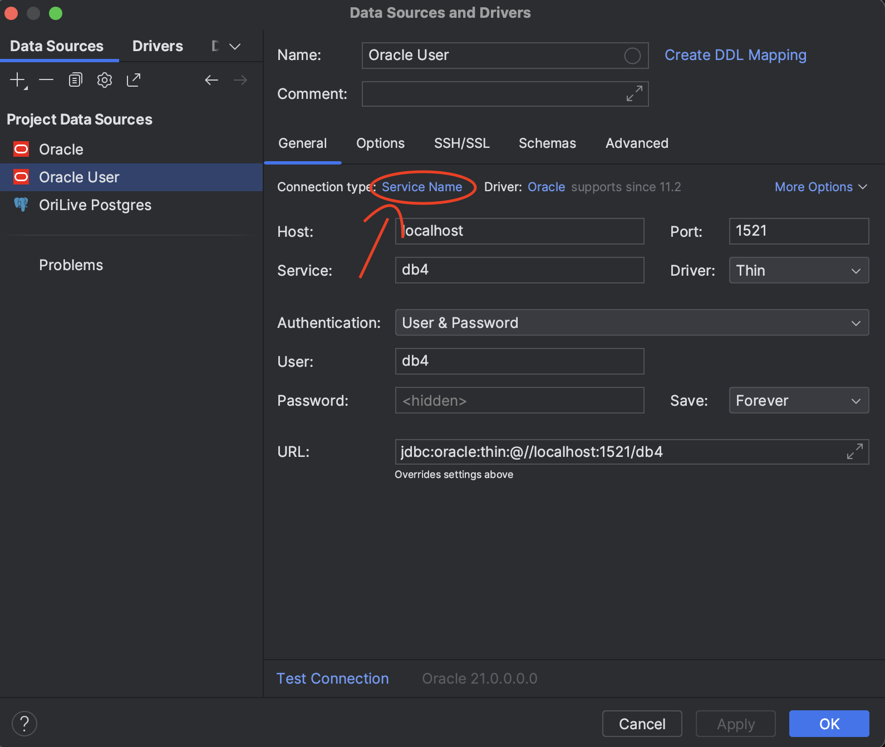
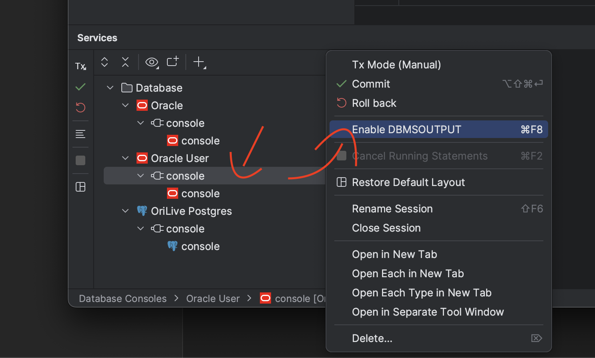

# PL/SQL Course resources
This folder contains resources for the PL/SQL course.

## Setup
### A) with Docker installed locally
If you have Docker installed on your machine, the only thing you need is to do is to download the `docker-compose.yml` file and run `docker-compose up -d` in the same folder as the file. This will download and start the containerized version of Oracle DB.

### B) if you do not have Docker, good luck with APEX, cuz I am not creating another VM :)))

## Oracle Database
The docker compose is using full version of the Oracle Database 21c.
Please, note that this is probably one of the heaviest docker images you will ever download, so be patient. Especially the first start of the database will take a while, usually around 5 minutes.

### Accessing the database
The database is accessible on the default port `1521` with the following credentials:

**Admin:**
- Username: `SYSTEM`
- Password: `kaktusdelta`

**User:**
- Username: `db4`
- Password: `kaktusdelta`
- Service Name: `db4`

### DataGrip tips:
When connecting to the database as a user from DataGrip (the superior JetBrains database IDE), make sure to change the connection type from `SID` to `Service Name` and use the following settings:

`DBMS_OUTPUT` messages are disabled by default in DataGrip, you can enable them by right clicking on the console tab and selecting `Enable DBMS_OUTPUT`:
